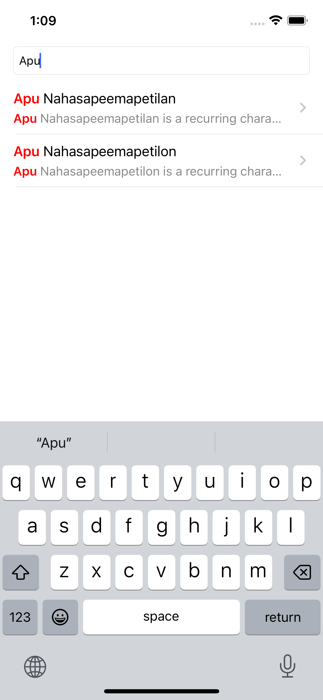
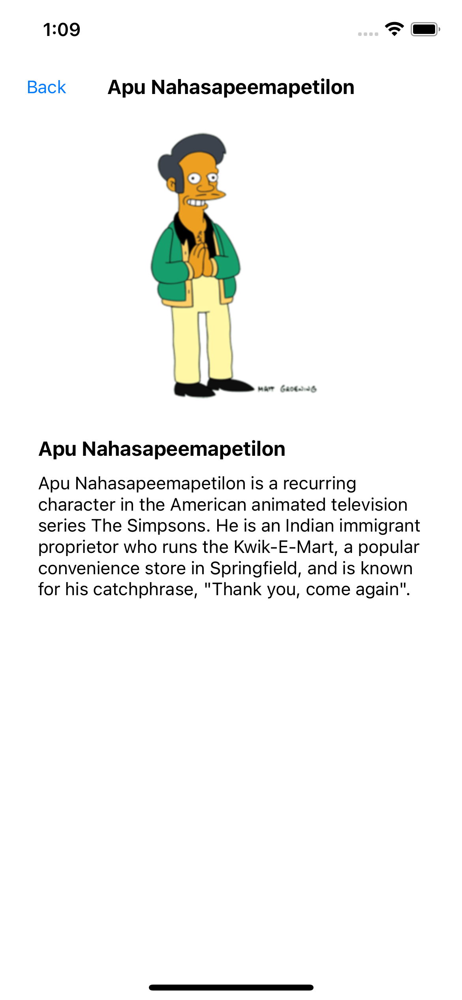
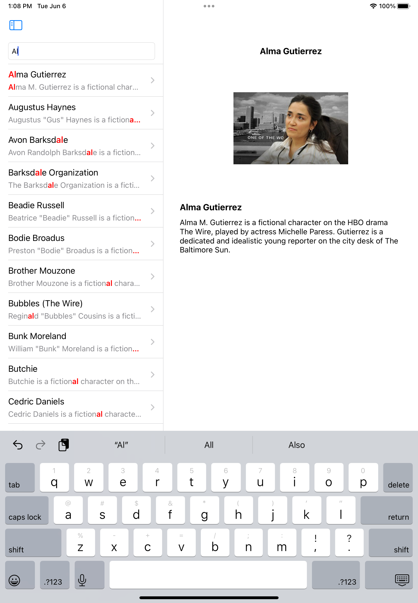

[![Swift Version][swift-image]][swift-url]

## Characters Viewer
 

 

[Play demo video](https://user-images.githubusercontent.com/58936686/243777869-eeecda40-722f-4b1d-b660-efb73e81aca9.mp4)

## Features

- Used MVVM architecture
- No SwiftUI, Used UIKit with Storyboard
- No 3rd party library used, No CocoaPod library integrated
- iPhone & iPad both support
- Splitted schemas to Simpsons & Wire

## Tools & Frameworks

- XCode 14.1
- iOS 16.1+ (Compatible to change this)

## Installation

Open CharacterViewer.xcodeproj in XCode.
Run directly (Available to change schames to Simsons or Wire)

## Meta

Daniel Song - daniel124eng@gmail.com

[https://github.com/crazy-me-dev](https://github.com/crazy-me-dev)

[swift-image]:https://img.shields.io/badge/swift-5.0-orange.svg
[swift-url]: https://swift.org/
[codebeat-image]: https://codebeat.co/badges/c19b47ea-2f9d-45df-8458-b2d952fe9dad
[codebeat-url]: https://codebeat.co/projects/github-com-vsouza-awesomeios-com
